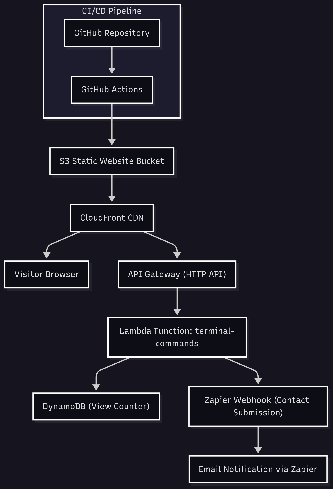

 codex/rewrite-portfolio-to-target-specific-tech-role
# josephaleto.io — Cloud Engineering Portfolio

# josephaleto.io — A Cloud Terminal Story
main

[](https://www.terraform.io/)
[](https://aws.amazon.com/)
[](https://github.com/features/actions)

Welcome! I'm **Joseph Leto**, a cloud architect focused on AWS (not currently AWS certified). I still deal poker on the side and code between shifts. I prefer to show rather than tell. This repository contains the source for my interactive terminal portfolio at [josephaleto.io](https://josephaleto.io). Every command you run on the site executes live Lambda code that I deployed through Terraform and GitHub Actions. It's a resume, a lab, and a real proof of how I build in the cloud.

Built to highlight my skills as a cloud engineer, this project demonstrates how I design, automate, and deploy modern infrastructure.

<p align="center">
  
</p>

---

## Try It Yourself

👉 Head over to [https://josephaleto.io](https://josephaleto.io) and type `help` in the terminal. From there you can explore commands like `resume`, `stack`, `architecture`, or even `offer` to send me your details.

---

## How It Started

This project began with the [Cloud Resume Challenge](https://cloudresumechallenge.dev/). I wanted more than a static page, so I built a full CLI experience. Visitors interact with a simulated shell that mirrors real AWS resources. Each command maps to a Lambda function—no demos or mock-ups, just working code.

---

## Architecture at a Glance

- **S3** hosts the static website
- **CloudFront** distributes content globally
- **API Gateway** receives each terminal command
- **Lambda** processes those commands
- **DynamoDB** tracks visitors and command usage
- **Terraform** manages every resource as code
- **GitHub Actions** drives continuous deployment

Pushing to `main` triggers a pipeline that builds the Lambda package and syncs the site to S3. It's the same process I use on client projects—automated, repeatable, and visible in version control.

---

## Key Features

- **Real Terminal Interface** — command history, tab completion, and colorful output
- **InfraMirror** — see the live stack directly from the terminal
- **Zapier Integration** — `offer` posts your info to a Zap for follow‑ups
- **Visitor Counter** — stored in DynamoDB and displayed via Lambda
- **Built‑in Commands** — from `resume` to `source code`, everything is a quick type away

---

## Technologies Used

- **React & JavaScript** for the terminal UI
- **AWS** — S3, CloudFront, API Gateway, Lambda, DynamoDB, Route 53
- **Terraform** for infrastructure as code
- **GitHub Actions** for CI/CD

---

## Getting Started

1. Fork this repo.
2. Copy `.env.example` to `.env` and configure your values.
3. In `infra/variables.tf`, set your AWS region, domain, and hosted zone ID.
4. From the `infra` directory run:
   ```bash
   terraform init
   terraform apply
   ```
5. Push your changes to `main` to deploy via GitHub Actions.

To customize terminal commands, edit `lambda/commands.js` and redeploy.

📚 **See detailed setup instructions in [`docs/DEVELOPMENT.md`](docs/DEVELOPMENT.md)**

## Documentation

- **[Development Guide](docs/DEVELOPMENT.md)** - Complete setup and development workflow
- **[Project Structure](docs/PROJECT_STRUCTURE.md)** - Repository organization and architecture
- **[Blackjack Game](docs/BLACKJACK_README.md)** - Game features and implementation details

---

## About Me

I'm **Joseph Leto**—a poker dealer who builds AWS solutions whenever I'm off the tables. Feel free to reach out or explore more of my work:

- [josephaleto.io](https://josephaleto.io)
- [joe@josephaleto.io](mailto:joe@josephaleto.io)
- [github.com/serversorcerer](https://github.com/serversorcerer)

---

Built from scratch. Architected for scale. Documented for clarity.
