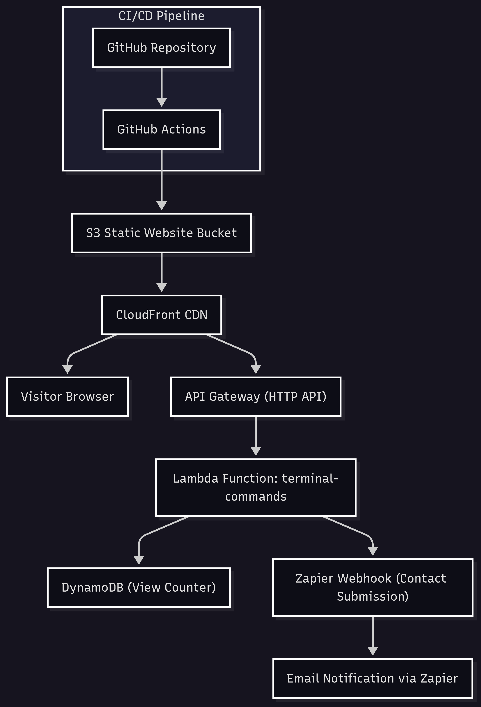

# josephaleto.io — Interactive Cloud Resume

[](https://www.terraform.io/)
[](https://aws.amazon.com/)
[](https://github.com/features/actions)

Welcome! I'm **Joseph Leto**, an SRE/DevOps engineer at **AWS Professional Services** who builds production platforms, ships secure CI/CD pipelines, and delivers solutions that make measurable impact. This repository powers my interactive terminal portfolio at [josephaleto.io](https://josephaleto.io).

**What makes this different?** Every command you run on the site executes live Lambda code deployed through Terraform and GitHub Actions. It's not just a resume—it's a working demonstration of modern cloud architecture.

This project showcases my skills in cloud engineering, infrastructure as code, and automated deployment pipelines.

<p align="center">
  
</p>

---

## Try It Yourself

👉 Head over to [https://josephaleto.io](https://josephaleto.io) and type `help` in the terminal. From there you can explore commands like `resume`, `stack`, `architecture`, or even `offer` to send me your details.

---

## The Story Behind This Project

This started as the [Cloud Resume Challenge](https://cloudresumechallenge.dev/)—a project to build a resume website using cloud technologies. But I wanted to go beyond a static page.

**My approach:** Build a fully interactive terminal experience where visitors can explore my skills through actual commands. Each command you type executes real Lambda functions that interact with live AWS resources. No mock-ups, no demos—just working cloud infrastructure.

---

## Architecture Overview

**Frontend:**
- **S3** hosts the static website files
- **CloudFront** provides global content distribution
- **Route 53** manages DNS routing

**Backend:**
- **API Gateway** receives terminal commands
- **Lambda** processes commands and game logic
- **DynamoDB** stores visitor data and game states

**DevOps:**
- **Terraform** manages all infrastructure as code
- **GitHub Actions** automates testing and deployment

**The workflow:** Push to `main` → GitHub Actions builds and tests → Lambda deploys → S3 syncs → Site updates. It's the same CI/CD process I use for production systems.

---

## What You Can Do

- **Interactive Terminal** — Full bash-like experience with command history and tab completion
- **Explore Commands** — Type `help` to see all available commands
- **View Architecture** — See the live infrastructure with `stack` command
- **Play Blackjack** — Full-featured casino game with real game logic
- **Contact Me** — Use `offer` to send your details via Zapier integration
- **Track Analytics** — Visitor counter stored in DynamoDB

---

## Technologies Used

- **React & JavaScript** for the terminal UI
- **AWS** — S3, CloudFront, API Gateway, Lambda, DynamoDB, Route 53
- **Terraform** for infrastructure as code
- **GitHub Actions** for CI/CD

---

## Quick Start Guide

**Want to build your own version?**

1. **Fork this repository**
2. **Configure your environment:**
   ```bash
   cp .env.example .env
   # Edit .env with your AWS settings
   ```
3. **Set up infrastructure:**
   ```bash
   cd infra
   terraform init
   terraform apply
   ```
4. **Deploy automatically:**
   Push to `main` branch to trigger GitHub Actions deployment

**Need help?** Check out the detailed setup guide in [`docs/DEVELOPMENT.md`](docs/DEVELOPMENT.md)

---

## Project Documentation

| Document | Purpose |
|----------|----------|
| **[Development Guide](docs/DEVELOPMENT.md)** | Complete setup instructions and development workflow |
| **[Project Structure](docs/PROJECT_STRUCTURE.md)** | How the codebase is organized |
| **[Blackjack Game](docs/BLACKJACK_README.md)** | Full-featured casino game implementation |

---

## About Me

I'm **Joseph Leto**—an AWS ProServe engineer who partners with stakeholders to ship platforms that scale. Production ownership over slide decks.

**Get in touch:**
- 🌐 [josephaleto.io](https://josephaleto.io) — Try the live terminal!
- 📧 [joe@josephaleto.io](mailto:joe@josephaleto.io) — Let's talk cloud architecture
- 🐙 [github.com/serversorcerer](https://github.com/serversorcerer) — More projects

---

**Built from scratch. Architected for production. Documented for developers.**

*This project demonstrates real-world cloud engineering skills through working code, not just buzzwords.*
